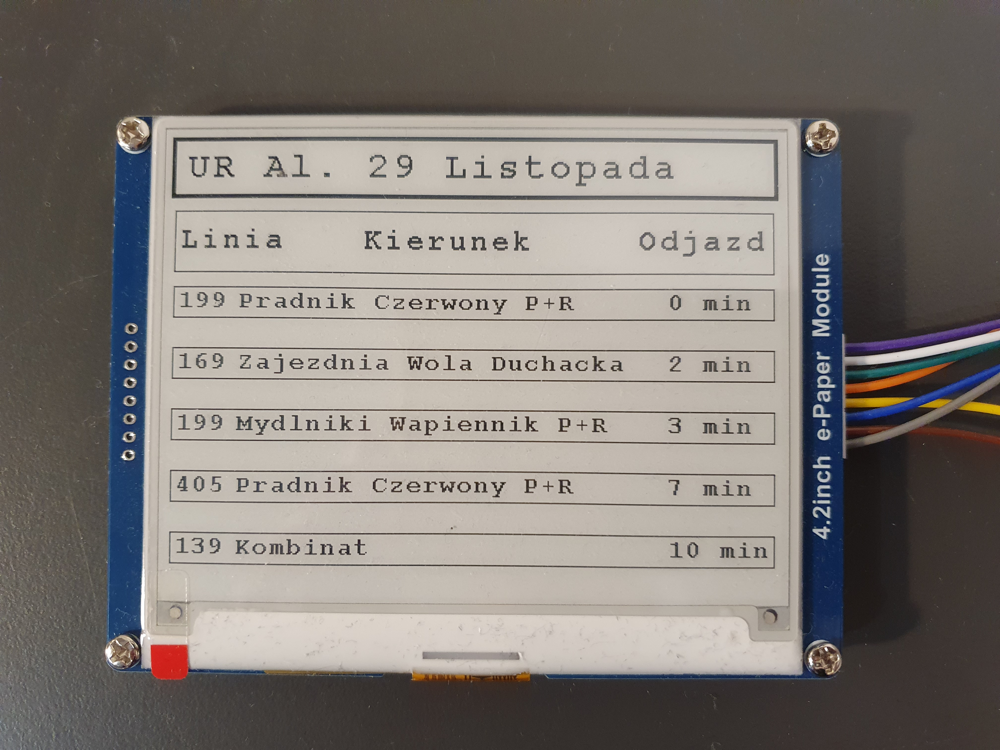

| Supported Targets | **ESP32** | ESP32-C2 (not tested) | ESP32-C3 (not tested) | ESP32-C6 (not tested) | ESP32-S2 (not tested) | ESP32-S3 (not tested) |
| ----------------- | ----- | -------- | -------- | -------- | -------- | -------- |

# _esp32-epaper-krk-departure-board_
An ESP32 project that downloads live transit data for MPK Kraków and shows it on an E-Paper screen. It features an easy Wi-Fi setup via mobile app and a stable Finite State Machine (FSM) architecture.

<center>
    
</center>

### Features
 - **Custom E-Paper Driver: Features a custom adaptation of the [official Waveshare E-Paper library originally designed for Raspberry Pi / Jetson Nano](https://github.com/waveshareteam/e-Paper/tree/master/RaspberryPi_JetsonNano/c/lib/Config), fully ported and optimized to work natively on the ESP32 architecture.**
 - Easy Setup: Wi-Fi Provisioning via SoftAP and mobile app (ESP SoftAP Provisioning).
 - Real-time API Integration: Downloads live departure data from MPK Kraków.
 - Stable Architecture: Uses Finite State Machine (FSM) logic for smart error recovery.
 - Low Power Display: Supports E-Paper screen for high contrast and low energy usage.
 - Hardware Factory Reset: Physical button to erase NVS memory and restart configuration.

## Hardware Requirements
To run this project, you will need the folowing components:
 - **Microcontroller:** ESP32 Development Board (e.g., standard ESP-WROOM-32 DevKit).
 - **Display:** 4.2" E-paper E-Ink 4,2" 400x300px with SPI - Waveshare 13353
 - **Misc Components:** 1x standard push button (Tact Switch) for the factory reset feature.

### Wiring
Here are the default connections between the ESP32 and the components.

| Component Pin | ESP32 GPIO | Description | Code Definition |
| :--- | :--- | :--- | :--- |
| **E-Paper VCC** | 3V3 | 3.3V Power Supply | - |
| **E-Paper GND** | GND | Ground | - |
| **E-Paper MOSI** | GPIO 23 | SPI MOSI | EPD_MOSI_PIN |
| **E-Paper SCLK** | GPIO 18 | SPI Clock | EPD_SCLK_PIN |
| **E-Paper CS** | GPIO 5 | Chip Select | EPD_CS_PIN |
| **E-Paper DC** | GPIO 21 | Data/Command | EPD_DC_PIN |
| **E-Paper RST** | GPIO 22 | Reset | EPD_RST_PIN |
| **E-Paper BUSY** | GPIO 26 | Busy Status | EPD_BUSY_PIN |
| **Button Pin 1** | GND | Ground | - |
| **Button Pin 2** | GPIO 12 | Factory Reset (Internal Pull-up) | WIFI_RESET_KEY |

*(Adjust the GPIO numbers in `components/epaper_lib/DEV_Config.h` (epaper) and `components/wifi_manager/wifi_manager.h` (wifi reset button) if you use different pins)*

## Software Requirements
- **Framework:** [ESP-IDF](https://docs.espressif.com/projects/esp-idf/en/latest/esp32/) (Espressif IoT Development Framework) **v5.3.1** or newer.
- **Programming Language:** C (C11 standard).
- **Build System:** CMake / Ninja (standard for ESP-IDF).
- **Mobile App:** *ESP SoftAP Provisioning* (available for free on Android & iOS) to provide Wi-Fi credentials

## Project Structure
The project is modularized using ESP-IDF components. The core logic resides in `main/`, while hardware and network abstractions are separated into `components/`.

Below is short explanation of remaining files in the project folder.

```text
esp32-epaper-krk-departure-board/
├── CMakeLists.txt              # Main project build file
├── main/
│   ├── CMakeLists.txt
│   └── main.c                  # Main application loop and FSM logic
├── docs/
│   ├── images/
│   └── Projekt_17_Autor_JakubŁudzik_ver_01.pdf     # Main project documentation
└── components/
    ├── debug/                 # Custom logging macro
    ├── epaper_lib/            # Low-level functions for ePaper handling (based on Waveshare examples for RaspberryPi_JetsonNano)
    ├── epaper_layout/         # Displaying text and content
    ├── mpk_api/               # HTTP client, JSON parsing
    ├── ntp_connect/           # Connecting to a time server
    └── wifi_manager/          # Connecting to a WiFi network and managing connection
```

## Quick Start
Follow these steps to build and run the project on your ESP32.

### 1. Clone the repository
Open your terminal and clone the project to your local machine:

```bash
git clone https://github.com/jludzik/esp32-epaper-krk-departure-board.git
```

```bash
cd esp32-epaper-krk-departure-board
```


### 2. Configure Custom Partition Table
This project uses a custom partition table (partitions.csv) to provide enough space for the application and NVS (Non-Volatile Storage). You must enable it before building:

Run the configuration menu:
```bash
idf.py menuconfig
```

>SDK Configuration editor -> Partition Table -> Partition Table -> :heavy_check_mark: Single factory app **(large)**, no OTA


### 3. Configure ESP-TLS for HTTPS Request
The MPK API uses HTTPS. To allow the ESP32 to fetch data without providing a root CA certificate manually, you need to enable skipping server verification:

>SDK Configuration editor -> Component config -> ESP-TLS -> ESP-TLS

>:heavy_check_mark: Allow potentially insecure options

>:heavy_check_mark: Skip server certificate verification by default (WARNING: ONLY FOR TESTING PURPOSE, READ HELP)


### 4. Building and Flashing
To build the project and flash it to your ESP32, use the standard ESP-IDF commands:
1. `idf.py set-target esp32` (if not already set)
2. `idf.py build`
3. `idf.py -p PORT flash monitor` (replace PORT with your COM port, e.g., COM3)

## End-User Guide (Wi-Fi Setup)
When you power on the device for the first time, it needs to be connected to your home Wi-Fi network. Follow these simple steps:

### 1. Power on the device
Plug the device into a power source. The E-Paper screen will show an initialization message, followed by a screen displaying a PIN code (default **PIN: 1234567**). This means the device is ready for setup.

### 2. Download the App
Download the official **ESP SoftAP Provisioning** app on your smartphone:
* [Get it on Google Play (Android)](https://play.google.com/store/apps/details?id=com.espressif.provsoftap)
* [Get it on the App Store (iOS)](https://apps.apple.com/us/app/esp-softap-provisioning/id1474040630)

### 3. Configure Wi-Fi
* Open the app and tap **Provision Device**.
* The app will ask you to connect to the ESP32's temporary Wi-Fi network. 
* Enter the exact PIN displayed on the E-Paper screen.
* Select your home Wi-Fi network from the list and type in your Wi-Fi password.
* Tap **Provision**.

### 4. Done
The device will save your Wi-Fi credentials, restart its internal state, and automatically begin downloading and displaying the live departure board.

### How to Factory Reset:
If you change your router or want to connect to a different network, simply press and hold the physical **Reset Button** during booting of device for few seconds. It will safely erase the saved Wi-Fi password from memory and return to the PIN screen.